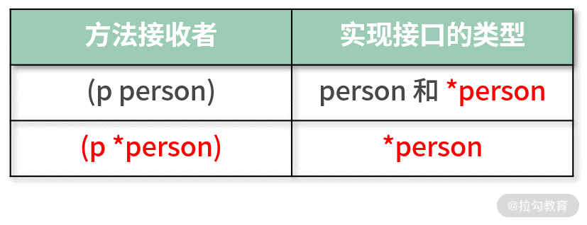

## 第一个程序：HelloWorld

[go语言在线运行](https://www.bejson.com/runcode/golang/)

```go
package main  //包名

import "fmt"   //程序中用到的库名

func main() {   //main函数
    fmt.Println("Hello world!")   //go语言不用;结尾
}
```


## 变量常量申明与基本类型

### 申明

go语言的一个特点是类型在变量名之后，以下三种**变量**申明方式等效：

- `var 变量名 类型 = 表达式` 

- `var 变量名 = 表达式` 让go自动类型推导

- `变量名 := 表达式` 让go自动类型推导，省略了var和变量类型

常量和变量不同在于使用`const`申明，如：`const name =  "飞雪无情"`。

### 基本类型

整型分为：

- **有符号整型**：如 int、int8、int16、int32 和 int64。
- **无符号整型**：如 uint、uint8、uint16、uint32 和 uint64。

浮点：float32 和 float64。

布尔值：true 和 false

字符串：类型 string，支持`+`操作来拼接字符串。


> 声明了一个变量，但是没有对其进行初始化，那么 Go 语言会自动初始化其值为对应类型的零值。比如数字类的零值是 0，布尔型的零值是 false，字符串的零值是 “” 空字符串等。


指针:Go语言中是有指针这个概念的，基本操作方式和C++类似：

```go
pi:=&i

*pi
```


## 其他

### 字符串和数字互转|不同数据类型的转换

不同数据类型转换：

```go
i2f:=float64(i)

f2i:=int(f64)
```

字符串与数字的转换：

```go
i2s:=strconv.Itoa(i)

s2i,err:=strconv.Atoi(i2s) //Go中函数是支持多返回值的，后面会讲到

fmt.Println(i2s,s2i,err)

```

通过包 strconv 的`Itoa`函数可以把一个 int 类型转为 string，Atoi 函数则用来把 string 转为 int。

同理对于浮点数、布尔型，Go语言提供了`strconv.ParseFloat`、`strconv.ParseBool`、`strconv.FormatFloat`和`strconv.FormatBool`进行互转，你可以自己试试。


### strings包

字符串和数字互相转换：Go SDK 为我们提供的一个标准包 `strings`。它是用于处理字符串的工具包，里面有很多常用的函数，帮助我们对字符串进行操作，比如查找字符串、去除字符串的空格、拆分字符串、判断字符串是否有某个前缀或者后缀等。掌握好它，有利于我们的高效编程。

## 控制结构：if、for、switch

### if

基本用法：

```go
if i >10 {
    fmt.Println("i>10")
} else if  i>5 && i<=10 {
    fmt.Println("5<i<=10")
} else {
    fmt.Println("i<=5")
}
```

在if中申明变量：

```go
if i:=6; i >10 { //在if中申明变量i
    fmt.Println("i>10")
} else if  i>5 && i<=10 {
    fmt.Println("5<i<=10")
} else {
    fmt.Println("i<=5")
}
```

### for

```go
sum:=0
for i:=1;i<=100;i++ {
    sum+=i
}
fmt.Println("the sum is",sum)
```

和其他语言一样，同样由于三部分组成：初值、判断、循环。

循环中仍然可以使用`continue`。

> Go中没有while循环，是通过for循环来实现的while循环，可见while一节。

### switch

```go
switch i:=6;{
case i>10:
    fmt.Println("i>10")
case i>5 && i<=10:
    fmt.Println("5<i<=10")
default:
    fmt.Println("i<=5")
}
```

**注意：** 不同于其他语言，Go中case之后默认是跳出的（自带break），如果想和其他语言一样不跳出，那么需要加入`fallthrough`关键字来取消跳出。


switch 后的表达式也没有太多限制，是一个合法的表达式即可，也不用一定要求是常量或者整数。

### while

Go中没有while循环，是通过for循环来实现的while循环：

```go
i:=1
for i<=100 {
    sum+=i
    i++
}
```

## 数组与map

### 数组(固定长度)

Array（数组）存放的是**固定长度**、**相同类型**的数据，而且这些存放的元素是连续的。所存放的数据类型没有限制，可以是整型、字符串甚至自定义。

> 固定长度表示Array的长度是不可变的。


#### 数组的申明
以下三种写法都是申明：长度为5、存放类型为string的`Array`。

```go
array:=[5]string{"a","b","c","d","e"}
```
```go
array:=[...]string{"a","b","c","d","e"} //省略长度的写法
```
```go
array1:=[5]string{1:"b",3:"d"} //只申明部分值的写法，其他默认为零值
```

> 注意：`[5]string` 和 `[4]string` 不是同一种类型，也就是说长度也是数组类型的一部分。

### 数组(动态长度)|切片

动态长度的数组成为Slice（切片），类似于C++的Vector和Java的ArrayList，其底层是长度连续的数组，且可以动态扩容。

#### 切片的申明

同样类似于C++的Vector的理解，Go中的Slice拥有长度（len）和容量（cap）的概念。

创建方式：

1. 使用`make`关键词

```go
slice1:=make([]string,4)   //方式1：指定长度为4
slice1:=make([]string,4,8)	//方式2：指定长度为4，容量为8
slice1:=[]string{"a","b","c","d","e"} //相对于申明Array，[]中没有...
```

2. 根据Array来创建

```go
array:=[5]string{"a","b","c","d","e"}

slice:=array[2:5] //同C++，包左不包右
```

> 包左不包右
> 
如果省略star或者end，那么star等价于0，end等价于最后一个index，比如：`array[:4]` 等价于 `array[0:4]`

**注意：基于数组的切片，使用的底层数组还是原来的数组，一旦修改切片的元素值，那么底层数组对应的值也会被修改。**

> 一般使用slice，而直接使用array比较少。

#### 切片的append

内置的 `append` 函数对一个切片追加元素，返回新切片。

```go
//追加一个元素
slice2:=append(slice1,"f")

//多加多个元素
slice2:=append(slice1,"f","g")

//追加另一个切片
slice2:=append(slice1,slice...)
```

关于append之后的新切片和append之前的切片是否共享底层，结论如下：

如果append之后不涉及扩容，即
$$
len(原来的Slice)+数量_{append} <= cap(原来的Slice)
$$
那么append之前与之后共享底层。

如果append之后会发生库容，那么append之前与之后不共享底层，相当于是创建了一个新的底层。

可用代码见证：

```go
package main

import (
	"fmt"
	//"reflect"
)

func main() {
	slice1 := make([]int, 1, 1) //声明一个切片，len为1，cap为1
	slice2 := append(slice1, 0)   //append之后发生扩容
	slice2[0] = 2
	fmt.Println(slice1)
	fmt.Println(slice2)
	fmt.Println("------------------------")
	slice1 = make([]int, 1, 2) //声明一个切片，len为1，cap为2
	slice2 = append(slice1, 0) //append之后不发生扩容
	slice2[0] = 2
	fmt.Println(slice1)
	fmt.Println(slice2)

}
/**
输出：
[0]
[2 0]
------------------------
[2]
[2 0]
*/
```


#### 数组|切片的循环访问：

两种方式：使用index的for循环 和 增强for循环。

**使用index 的for循环：**

```go
for i:=0;i<5;i++{
    fmt.Printf("数组索引:%d,对应值:%s\n", i, array[i])
}
```

**增强for循环**

```go
for i,v:=range array{
 	//i是索引index，v是具体的值
    fmt.Printf("数组索引:%d,对应值:%s\n", i, v)
}
```

#### 补充

##### string与[]byte

字符串 string 也是一个不可变的字节序列，所以可以直接转为字节切片 []byte ，基本操作：

```go
s:="Hello飞雪无情"

bs:=[]byte(s)

fmt.Println(bs)

fmt.Println(s[0],s[1],s[15])

fmt.Println(len(s)) //输出 17
```

需要注意的是：在这个示例中，字符串 s 里的字母和中文加起来不是 9 个字符吗？怎么可以使用 s[15] 超过 9 的索引呢？其实恰恰就是因为字符串是字节序列，每一个索引对应的是一个字节，而在 UTF8 编码下，一个汉字对应三个字节，所以字符串 s 的长度其实是 17。

如果你想把一个汉字当成一个长度计算，可以使用 utf8.RuneCountInString 函数。运行下面的代码，可以看到打印结果是 9，也就是 9 个 unicode（utf8）字符，和我们看到的字符的个数一致。

```go
fmt.Println(utf8.RuneCountInString(s))
```

而使用 for range 对字符串进行循环时，也恰好是按照 unicode 字符进行循环的，所以对于字符串 s 来说，循环了 9 次。

在下面示例的代码中，i 是索引，r 是 unicode 字符对应的 unicode 码点，**这也说明了 `for range` 循环在处理字符串的时候，会自动地隐式解码 `unicode` 字符串。**

### map与set

#### map

`map` 是一个无序的 K-V 键值对集合，结构为 `map[K]V`。其中 K 对应 Key，V 对应 Value。

`map` 中所有的 `Key` 必须具有相同的类型，`Value` 也同样，但 Key 和 Value 的类型可以不同。

**此外，Key 的类型必须支持 `==` 比较运算符，这样才可以判断它是否存在，并保证 Key 的唯一。**

##### map的声明与基本操作

这部分的基本操作与其他语言差距不大，稍微看一下应该就知道对应什么操作了。

```go
nameAgeMap:=make(map[string]int)  //make 创建map，key为string类型，value为int类型
```

```go
nameAgeMap["一山"] = 20   //没有key为“一山”，则创建这个key，有这个key则修改对应的值
```

```go
//获取指定 Key 对应的 Value
// 单个返回值
age:=nameAgeMap["一山"]

//多个返回值，分别对应：key对应的value，key是否存在
age,ok:=nameAgeMap["一山"]
```

```go
delete(nameAgeMap,"飞雪无情") //删除对应的key-value
```

```go
//类似于Go中的增强for循环，使用range关键词遍历map
for k,v:=range nameAgeMap{
    fmt.Println("Key is",k,",Value is",v)
}
```

> map 的遍历是无序的,**每次遍历，键值对的顺序可能会不一样。** 
>
> **注意：是每次遍历都可能不同，而不仅仅是key无序**
>
> 如果想按顺序遍历，可以先获取所有的 Key，并对 Key 排序，然后根据排序好的 Key 获取对应的 Value。

> for range map 的时候，也可以使用一个值返回。使用一个返回值的时候，这个返回值默认是 map 的 Key。

```go
fmt.Println(len(nameAgeMap)) //获取map的大小
```


#### set

Go中并没有提供现成的Set，但是可以通过`map`来曲线救国，基本思路：**只使用map中的key，value虽然存在但是不使用。**进阶一点：考虑到value占用空间，将value使用void来避免空间占用。

>  具体见：https://zhuanlan.zhihu.com/p/67580188

#### 拓展：

##### 如何实现key可以重复的map？

Go中不提供key可以重复的map，其中一个思路就是**将map的value设置为Slice**，用Slice存放重复的value。

### 函数与方法

牵扯到函数与方法就与 对象、类 的概念紧密相关了。

在其他语言（Java、C++）中，方法分成两种：类函数（方法），普通函数（非类方法）。

Go中也类似，不过语法上有比较大的区别。

#### Go中普通函数：

```go
//单返回值
func sum(a int,b int) int{
//格式为：func funcName(params) result
    return a+b

}

//多返回值
func sum(a, b int) (int,error){
    if a<0 || b<0 {
        return 0,errors.New("a或者b不能是负数")
    }
    return a + b,nil
}

```

#### Go中方法：

在其他语言（Java、C++）中，方法与函数的区别之一在于方法必须属于一个对象。对于Go来说，方法必须拥有一个接受者（也可以理解成对象）。

> 这里Go语言和其他语言就有比较明显的区别了。

比如：

```go
//定义
type Age uint
func (age Age) String(){
    fmt.Println("the age is",age)
}
//调用：和其他语言类似
func main() {
    age:=Age(25)
    age.String()   //调用String函数
    //输出：the age is 25
}
```

##### 方法内部修改接受者，接受者在外部是否真的改变了？

这个问题是一个经典问题，在C++和Java语言中分别的答案是：

- Java中，对于自定义的类，如果在任意函数内部修改了这个类，那么类实际上是改变了，可以理解成是Java函数实际传入的是“指针”或者“引用”。

- 在C++中，对于自定义的类，要看传入的是对象还是指针：
  - 如果是对象，那么是值拷贝，任意函数内部修改不影响外部。
  - 对指针也是值拷贝，对指针本身的修改同样不会影响外部，但是对指针指向的对象`*ptr`的修改是会影响外部的。
  - **Go中没有”引用“这一概念**，因此这里不讨论引用的情况。

看一下指针类型和值类型分别调用

```go
package main

import (
	"fmt"
	"reflect"
)

type myAge uint

func (a myAge) changAgeTo30() {
	a = 30
}
func (a *myAge) changeAgeTo30PtrReceive() {
	*a = 30
}
func main() {
	value := myAge(0)
	fmt.Println(reflect.TypeOf(value))
	value.changAgeTo30()
	fmt.Println(value)
	value.changeAgeTo30PtrReceive()
	fmt.Println(value)
	fmt.Println("上方是值类型调用方法---------------------下方是指针类型调用方法")
	value = 0
	ptr := &value
	ptr.changAgeTo30()
	fmt.Println(*ptr)
	ptr.changeAgeTo30PtrReceive()
	fmt.Println(*ptr)
}
/*
输出：
main.myAge
0
30
---------------------
0
30
*/
```

根据函数输出有如下结论：

- 接收者是值拷贝，即方法内部对接收者的修改不会影响外部。如果想修改接收者的值，只能通过对指针`*ptr`的操作来完成。
- 无论方法接收者是值还是指针，调用的方式都是`.`，相当于Go语言完成了“解引用”或者“取地址”这步。

> 第二点突出了Go语言的简洁的特点，但是个人不喜欢，因为这样对于类型的判断就不是很清晰了。在C++中如果是指针，那么调用函数使用`->`，看起来麻烦，但是实际编写的时候IDE会完成这一步，因此编写体验没有区别，类型也很清晰。


#### 其他

##### 下划线

Go语言中，我们常能看见`_`，如：

```go
result,_ := sum(1, 2)
```

这是为什么呢？

因为Go中要求定义的变量必须有使用。

如果没有使用无法通过编译，那么想象这么一个场景，函数有多返回值，但是我只在乎其中的一个，对于另一个值并不关心，，这时候就可以用`_`来接收不需要的返回值。（定义的变量必须有使用，但对于`_`没有这个要求）

##### 多返回值补充写法

额外写法：

```go
func sum(a, b int) (sum int,err error){
    if a<0 || b<0 {
        return 0,errors.New("a或者b不能是负数")
    }
    sum=a+b
    err=nil
    return 
}
```

##### 可变参数：

```go
func sum1(params ...int) int {
    sum := 0
    for _, i := range params {
        sum += i
    }
    return sum
}
```

> 注意：可变参数只能是最后一个参数


##### 函数可见性

了解函数可见性首先要了解包这个概念，在上面的代码中：

```go
package main

import (
	"fmt"
	"reflect"
)

type myAge uint

func (a myAge) changAgeTo30() {
	a = 30
}
func (a *myAge) changeAgeTo30PtrReceive() {
	*a = 30
}
func main() {
	value := myAge(0)
	fmt.Println(reflect.TypeOf(value))
	value.changAgeTo30()
	fmt.Println(value)
	value.changeAgeTo30PtrReceive()
	fmt.Println(value)
	fmt.Println("上方是值类型调用方法---------------------下方是指针类型调用方法")
	value = 0
	ptr := &value
	ptr.changAgeTo30()
	fmt.Println(*ptr)
	ptr.changeAgeTo30PtrReceive()
	fmt.Println(*ptr)
}

```

用到了这么几个包：

- 当前包：main包
- 调用的包："fmt"，"reflect"

**Go语言中包的可见性不是通过关键词来区别，而是通过首字母大小写来区别**

同一个包中的函数哪怕是私有的（函数名称首字母小写）也可以被调用。如果不同包的函数要被调用，那么函数的作用域必须是公有的，也就是**函数名称的首字母要大写**，比如 Println。

在后面的包、作用域和模块化的课程中我会详细讲解，这里可以先记住：

1. 函数名称首字母小写代表私有函数，只有在同一个包中才可以被调用；
2. 函数名称首字母大写代表公有函数，不同的包也可以调用；
3. 任何一个函数都会从属于一个包。

> **对于后面用到的结构体也是类似，是用首字母大小写来区别外部是否可以直接修改。**

> Go 语言没有用 public、private 这样的修饰符来修饰函数是公有还是私有，而是通过函数名称的大小写来代表，这样省略了烦琐的修饰符，更简洁。


##### 匿名函数

```go
func main() {
    sum2 := func(a, b int) int {
        return a + b
    }
    fmt.Println(sum2(1, 2))
}
```

其中**sum2是**一个函数类型的**变量**，而不是匿名函数。

##### 闭包：

```go
func main() {
    cl:=colsure()
    fmt.Println(cl())
    fmt.Println(cl())
    fmt.Println(cl())
}

func colsure() func() int {
    i:=0
    return func() int {
        i++
        return i
    }
}
```


### 结构体与接口

#### 结构体

结构体的含义：

和其他语言基本上是类似的，可以看成是许多字段的集合体。

和其他语言不同的是，**结构体可以作为方法的接收者**。

> Go语言中是没有类和继承的，那么在部分程度上，将Go中的结构体 类比成 其他语言的类 这一概念比较合适。

结构体定义方式：

```go
type structName struct{
    fieldName typeName
    ....
    ....
}
//如：
type person struct {
    name string
    age uint
}
```

> 结构体的成员字段并不是必需的，也可以一个字段都没有，这种结构体成为空结构体。

结构体初始化方式：

```go
//方式1
var p person //没有显式定义，就用零值初始化
//方式2
p:=person{"飞雪无情",30} // 按照字段顺序初始化
//方式3
p:=person{age:30,name:"飞雪无情"} // 不按照字段顺序初始化，这种方式也可以只初始化某些字段
```


#### 接口

接口的含义：

接口是方法的集合体，其只约束了方法的声明，而不约束方法的具体实现，是Go语言做到抽象的关键。

> Go语言中是没有类和继承的，那么在如果想实现类似于其他语言的“多态”这一方式，就需要使用到Go的接口了。


接口的定义：

```go
type Stringer interface {
    String() string
}
```

如何实现一个接口：

以上面的`Stringer`接口为例，需要实现`Stringer`下面**所有**的方法，就算实现了Stringer接口。

比如：

```go
func (p person) String()  string{
    return fmt.Sprintf("the name is %s,age is %d",p.name,p.age)
}
```


> 是的，就是这么“松散”的感觉，因为无论有没有这个Stringer接口，person结构体都可以拥有这个方法。
> 个人并不喜欢这点，如果接口和结构体没有写在一起，那么除了IDE的智能提醒和程序运行出错之外，感觉很难知道类是否实现了一个接口，怎么保证没有疏漏某一个方法呢？？？
> 


接口的使用：

当一个类实现一个接口之后，那么传入接口的地方，就可以传入实现接口的这个类。

延续上方的代码的例子：

```go
func printString(s fmt.Stringer){
    fmt.Println(s.String())
}
printString(p) //输出：the name is 飞雪无情,age is 30
```

这里我们需要注意易错的情况：

在上方[方法内部修改接受者，接受者在外部是否真的改变了？](#方法内部修改接受者，接受者在外部是否真的改变了？)一节中，我们有如下结论：

- 无论方法接收者是值还是指针，调用的方式都是`.`，相当于Go语言完成了“解引用”或者“取地址”这步。

**但是接口的实现，只有以值接收者才算实现了这个接口，以指针接收者接收是不算实现接口的。**

代码演示：

```go
type Stringer interface {
    String() string
}
func (p person) String()  string{
    return fmt.Sprintf("the name is %s,age is %d",p.name,p.age)
}
func printString(s fmt.Stringer){
    fmt.Println(s.String())
}
//省略创建一个p person的代码
printString(p) //值传入，正常输出
printString(&p) //指针传入，正常输出
```

```go
type Stringer interface {
    String() string
}
func (p *person) String()  string{  //与上方不同之处
    return fmt.Sprintf("the name is %s,age is %d",p.name,p.age)
}
func printString(s fmt.Stringer){
    fmt.Println(s.String())
}
//省略创建一个p person的代码
printString(p)
//编译不通过：
//./main.go:17:13: cannot use p (type person) as type fmt.Stringer in argument to printString:
//    person does not implement fmt.Stringer (String method has pointer receiver)
printString(&p)
//能通过编译
```

情况看起来有些特殊，稍微绕一点，总结一下吧：



#### 其他补充

> Go中虽然有接口和结构体，但没有类和继承，那么Go如何解决拥有类和结构体语言中的如下问题的呢？
>
> - 构造函数：工厂函数
> - 继承：组合代替继承
> - 多态：类型断言


上面的提到Go中没有类和继承，那么Go中自然没有其他语言中继承最好is-a的约束了，是的，Go推荐用组合代替继承。

---

Q：如果我规定必须以某些方式初始化Go中的结构体应该如何操作呢？即实现其他语言的”构造函数“这一操作？
A：一般自定义一个函数来实现，如下：

```go
func NewPerson(name string) *person {
    return &person{name:name}
}

```
比如`errors.New`其实就是Go语言自带的工厂函数。

> 这也是个人不喜欢的一点，Go语言实在是太精简。
>

---

结构体的一些其他使用方式：

```go
p:=person{
        age:30,
        name:"飞雪无情",
        address:address{
            province: "北京",
            city:     "北京",
        },
    }
//像使用自己的字段一样，直接使用
fmt.Println(p.province)
```

因为 person 组合了 address，所以 address 的字段就像 person 自己的一样，可以直接使用。

类型组合后，外部类型不仅可以使用内部类型的字段，也可以使用内部类型的方法，就像使用自己的方法一样。如果外部类型定义了和内部类型同样的方法，那么外部类型的会覆盖内部类型，这就是方法的覆写。关于方法的覆写，这里不再进行举例，你可以自己试一下。


---

类型断言（接口与结构体的转换）：在传入接口的函数中可以传入实现了这个接口的结构体，那么不严谨的来讲，这种关系有点类似于C++中的子类与父类的多态（在传入父类的函数中可以传入子类）。

在C++中多态的父类和子类可以相互转换（cast），那么Go中可以转换 接口与结构体吗？

可以的，这种称为 **类型断言**。

如下代码：

```go
func (p *person) String()  string{
    return fmt.Sprintf("the name is %s,age is %d",p.name,p.age)
}

func (addr address) String()  string{
    return fmt.Sprintf("the addr is %s%s",addr.province,addr.city)
}
```

*person 和 address 都实现了接口 Stringer

```go
//重点
var s fmt.Stringer
s = p1 //p1类型原始为*person，在这里用接口s来接收了
p2:=s.(*person) //类型断言，这里断言成功，成功后p2的类型为*person，相当于完成了类型转换
fmt.Println(p2)
```

在上面代码演示中演示了断言成功，那么失败呢？

比如如下代码，一个接收值会触发运行时panic：

```go
a:=s.(address) //编译不会有问题，因为address实现了接口，但是会运行时候异常：panic: interface conversion: fmt.Stringer is *main.person, not main.address
fmt.Println(a)
```

或者两个返回值避免运行时异常：

```go
a,ok:=s.(address)//型断言返回的第二个值“ok”就是断言是否成功的标志，如果为 true 则成功，否则失败。
if ok {
    fmt.Println(a)
}else {
    fmt.Println("s不是一个address")
}
```


### 错误处理


在 Go 语言中，错误是可以预期的，并且不是非常严重，不会影响程序的运行。对于这类问题，可以用返回错误给调用者的方法，让调用者自己决定如何处理。

#### error 接口

在 Go 语言中，**错误是通过内置的 error 接口表示的**。它非常简单，只有一个 Error 方法用来返回具体的错误信息，如下面的代码所示：

```go
type error interface {
   Error() string
}
```

> 回顾一下之前的内容：如果一个结构体实现了一个接口下的所有方法，那就算实现了这个接口。
>
> 那么这里只要实现了`Error()`方法，就算实现了`error interface`。


对于自定义的函数，一般使用 errors.New 这个工厂函数生成的错误信息：

```go
func add(a,b int) (int,error){
   if a<0 || b<0 {
      return 0,errors.New("a或者b不能为负数")
   }else {
      return a+b,nil
   }
}
```


这种多返回值携带错误的案例在标准库中也有使用，如：

```go
func Atoi(s string) (int, error)
```


#### 自定义error

如上面error接口展示，error信息只携带一个字符串str，如果有拓展信息就无法满足了，比如下方，想让返回的错误可以携带错误码和错误信息两个信息：

```go
type commonError struct {
   errorCode int //错误码
   errorMsg string //错误信息
}
//实现error interface接口
func (ce *commonError) Error() string{
   return ce.errorMsg
}
```

这时候怎么从error 得到 自定义的commonError，可以用到前面**类型断言**的方法将error接口类型转换成自定义的commonError，从而获取更多的信息。

> 虽然可以使用**类型断言**，但是由于error嵌套的存在，在嵌套error的情况下无法直接使用，那么一般用Go语言提供的errors.As 函数代替类型断言。
>
> 关于嵌套eror下方会讲解。


#### 错误嵌套|Error Wrapping

错误嵌套的存在是基于这么一个需求：想基于现有的error再生成一个新的error。

> 想象一个稍微具体点的场景，函数调用了其他函数，在其他函数有错误返回的肯定需要对这个错误进行包装一番。

1.13 版本开始，Go 标准库新增了 Error Wrapping 功能，让我们可以基于一个存在的 error 生成新的 error，并且可以保留原 error 信息。（之前版本需要自己定义嵌套，这里不展开了）

```go
e := errors.New("原始错误e")
w := fmt.Errorf("Wrap了一个错误:%w", e)
fmt.Println(w)
```

既然 error 可以包裹嵌套生成一个新的 error，那么也可以被解开，即通过 errors.Unwrap 函数得到被嵌套的 error。

Go 语言提供了 errors.Unwrap 用于获取被嵌套的 error，比如以上例子中的错误变量 w ，就可以对它进行 unwrap，获取被嵌套的原始错误 e。

```go
errors.Unwrap(w)
```

##### errors.Is 和 errors.As 函数

既然可以wrap和unwrap，那么一个显然的问题是：如何知道wrap了几层呢？是否还需要再unwrap？


有了 Error Wrapping 后，你会发现原来用的判断两个 error 是不是同一个 error 的方法失效了，比如 Go 语言标准库经常用到的如下代码中的方式：

```go
if err == os.ErrExist
```

于是 Go 语言为我们提供了 errors.Is 函数，用来判断两个 error 是否是同一个，如下所示：

```go
func Is(err, target error) bool
```

以上就是errors.Is 函数的定义，可以解释为：

- 如果 err 和 target 是同一个，那么返回 true。
- 如果 err 是一个 wrapping error，target 也包含在这个嵌套 error 链中的话，也返回 true。


#### errors.As 函数

同样的原因，有了 error 嵌套后，error 的类型断言也不能用了，因为你不知道一个 error 是否被嵌套，又嵌套了几层。所以 Go 语言为解决这个问题提供了 errors.As 函数，比如前面 error 断言的例子，可以使用 errors.As 函数重写，效果是一样的，如下面的代码所示：

```go
var cm *commonError
if errors.As(err,&cm){ // 如果可以转换，那么cm就已经指向了对应的commonError了
   fmt.Println("错误代码为:",cm.errorCode,"，错误信息为：",cm.errorMsg)
} else {
   fmt.Println(sum)
}
```

**所以在 Go 语言提供的 Error Wrapping 能力下，我们写的代码要尽可能地使用 Is、As 这些函数做判断和转换。**


#### 其他补充

##### defer函数

Go 语言为我们提供了 defer ，用于在函数结束后执行一些其他函数，一般用于必须执行但是容易遗忘的函数，比如文件的关闭、锁的释放等等。

```go
func ReadFile(filename string) ([]byte, error) {
   f, err := os.Open(filename)
   if err != nil {
      return nil, err
   }
   defer f.Close()  //会在ReadFile最后再执行。
   //省略无关代码
   return readAll(f, n)
}
```


##### panic错误

Go 语言是一门静态的强类型语言，很多问题都尽可能地在编译时捕获，但是有一些只能在运行时检查，比如数组越界访问、不相同的类型强制转换等，这类**运行时的问题会引起 panic 异常**。

除了运行时可以产生 panic 外，我们自己也可以抛出 panic 异常，如：

```go
func connectMySQL(ip,username,password string){
   if ip =="" {
      panic("ip不能为空")
   }
   //省略其他代码
}
```


panic 是 Go 语言内置的函数，可以接受 interface{} 类型的参数，也就是任何类型的值都可以传递给 panic 函数，如下所示：

```go
func panic(v interface{})
```

> 小提示：interface{} 是空接口的意思，在 Go 语言中代表任意类型。

panic 异常是一种非常严重的情况，会让程序中断运行，使程序崩溃，所以**如果是不影响程序运行的错误，不要使用 panic，使用普通错误 error 即可。**


通常情况下，我们不对 panic 异常做任何处理，因为既然它是影响程序运行的异常，就让它直接崩溃即可。但是也的确有一些特例，比如在程序崩溃前做一些资源释放的处理，这时候就需要从 panic 异常中恢复，才能完成处理。

在 Go 语言中，可以通过内置的 recover 函数恢复 panic 异常。因为**在程序 panic 异常崩溃的时候，只有被 defer 修饰的函数才能被执行**，所以 recover 函数要结合 defer 关键字使用才能生效。

示例是通过 defer 关键字 + 匿名函数 + recover 函数从 panic 异常中恢复的方式:

```go
func main() {
   defer func() {
      if p:=recover();p!=nil{
         fmt.Println(p)
      }
   }()
   connectMySQL("","root","123456")
}
//输出：ip 不能为空
```

通过这个输出的结果也可以发现，`recover`函数返回的值就是通过`panic`函数传递的参数值。


2024-5-6 完成了 TODO

```
https://learn.lianglianglee.com/%e4%b8%93%e6%a0%8f/22%20%e8%ae%b2%e9%80%9a%e5%85%b3%20Go%20%e8%af%ad%e8%a8%80-%e5%ae%8c/08%20%20%e5%b9%b6%e5%8f%91%e5%9f%ba%e7%a1%80%ef%bc%9aGoroutines%20%e5%92%8c%20Channels%20%e7%9a%84%e5%a3%b0%e6%98%8e%e4%b8%8e%e4%bd%bf%e7%94%a8.md
```

