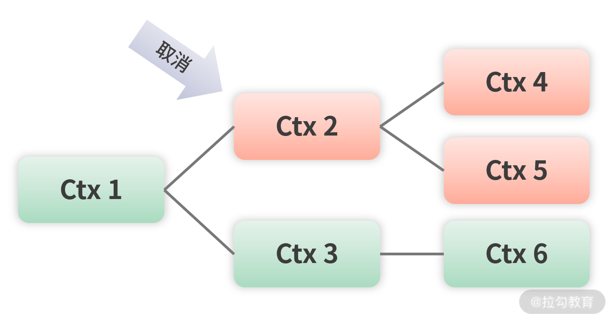

## Goroutines 和 Channels

<u>在正式开始之前，最好已经掌握了：并发、并行，进程、线程、协程的区别和联系。</u>


Go 语言中没有线程的概念，只有协程，也称为`goroutine`，一个程序可以随意启动成千上万个`goroutine`。


### 协程（Goroutine）

`goroutine`可以理解成go中的协程，需要并发执行其他函数的时候时候即可。

启动非常简单，`go function_name()`即可启动，如下：

```go
func main() {
   go fmt.Println("飞雪无情")
   fmt.Println("我是 main goroutine")
   time.Sleep(time.Second)
}
```


### Channel

#### **Channel是什么？用来解决什么问题？**

Channel是管道，用于解决多个goroutine之间通讯的问题，是并发安全的。

> 如果没有Channel，那么多个goroutine之间如何通信呢？
>
> 要么自行实现并发安全的队列，要么用共享变量+锁等方式，实在不优雅，Channel相当于go语言提供了一个并发安全的队列。

#### **Channel的声明**

```go
ch:=make(chan string)  //创建缓冲大小为0的channel
```

定义好 chan 后就可以使用了。

一个 chan 的操作只有两种：发送和接收。

1. 接收：获取 chan 中的值，操作符为 <- chan。
2. 发送：向 chan 发送值，把值放在 chan 中，操作符为 chan <-。

一个goruntime在接收Channel数据的时候，如果 ch 中没有值，则会**阻塞等待**到 ch 中有值可以接收为止。

#### channel的缓冲

Channel是可以在创建的时候设置缓冲大小的，比如：

```go
cacheCh:=make(chan int,5)  //缓冲大小为5
```


 channel 具备以下特点：

1. 有缓冲 channel 的内部有一个缓冲队列；
2. 发送操作是向队列的尾部插入元素，**如果队列已满，则阻塞等待，直到另一个 goroutine 执行，接收操作释放队列的空间**；
3. 接收操作是从队列的头部获取元素并把它从队列中删除，**如果队列为空，则阻塞等待，直到另一个 goroutine 插入新的元素**。


#### channel的关闭

```go
close(cacheCh)
```


> 如果一个 channel 被关闭了，就不能向里面发送数据了，如果发送的话，会引起 painc 异常。但是还可以接收 channel 里的数据，如果 channel 里没有数据的话，接收的数据是元素类型的零值。


#### 单向channel

channel是双向的，但是有时候需要限制一个 channel 只可以接收但是不能发送，或者限制一个 channel 只能发送但不能接收，这种 channel 称为单向 channel。

单向 channel 的声明也很简单，只需要在声明的时候带上 <- 操作符即可，如下面的代码所示：

```go
onlySend := make(chan<- int)
onlyReceive:=make(<-chan int)
```


> 如果说创建了一个只能发送或者只能接收数据的channel，那么数据发送过去之后如何接收呢？
>
> 所以一般情况下是用于函数中参数中限制channel的操作，而不是创建的时候。


在函数或者方法的参数中，使用单向 channel 的较多，这样可以防止一些操作影响了 channel。

下面示例中的 counter 函数，它的参数 out 是一个只能发送的 channel，所以在 counter 函数体内使用参数 out 时，只能对其进行发送操作，如果执行接收操作，则程序不能编译通过。

```go
func counter(out chan<- int) {
  //函数内容使用变量out，只能进行发送操作
}
```


#### select+channel示例

> 此select非linux操作系统中IO多路复用的概念，只能说有相似的地方。

select + channel的组合和IO多路复用有点相似，可以达到优雅的监听多路channel的目的，任一channel都可以触发select。

语法：

```go
select {
   case i1 = <-c1:
     //todo
   case c2 <- i2:
	   //todo
   default:
	   // default todo
}
```


案例：

```go
func main() {

   //声明三个存放结果的channel
   firstCh := make(chan string)
   secondCh := make(chan string)
   threeCh := make(chan string)

   //同时开启3个goroutine下载
   go func() {
      firstCh <- downloadFile("firstCh")
   }()

   go func() {
      secondCh <- downloadFile("secondCh")
   }()

   go func() {
      threeCh <- downloadFile("threeCh")
   }()

   //开始select多路复用，哪个channel能获取到值，
   //就说明哪个最先下载好，就用哪个。
   select {
      case filePath := <-firstCh:
         fmt.Println(filePath)
      case filePath := <-secondCh:
         fmt.Println(filePath)
      case filePath := <-threeCh:
         fmt.Println(filePath)
   }
}
```

函数作用说明：下载三个文件，哪个下好了赋值给`filePath`，其他的就不管了。


#### 总结

在 Go 语言中，提倡通过通信来共享内存，而不是通过共享内存来通信，其实就是提倡通过 channel 发送接收消息的方式进行数据传递，而不是通过修改同一个变量。所以在**数据流动、传递的场景中要优先使用 channel，它是并发安全的，性能也不错。**


## 并发安全

<u>此章开始之前，希望你对并发安全、锁（互斥锁、读写锁）、资源竞争等有一些概念。</u>

并发安全部分主要内容：

- sync.Mutex：互斥锁
- sync.RWMutex 读写锁
- sync.WaitGroup 并发安全记数和等待

- sync.Once 保证函数只执行一次
- sync.Cond 条件变量

#### sync.Mutex

互斥锁

```go
var(
   sum int
   mutex sync.Mutex
)

func add(i int) {
   mutex.Lock()
   sum += i
   mutex.Unlock()  //解锁换成defer更加合适，这里是方便理解所以这么写
}
```


#### sync.RWMutex

读写锁

```go
var mutex sync.RWMutex
func readSum() int {

   //只获取读锁
   mutex.RLock()
   defer mutex.RUnlock()
   b:=sum

   return b

}
```

和其他语言相同，sync.RWMutex满足：读写互斥、写写互斥、读读不互斥。


#### sync.WaitGroup

`sync.WaitGroup`内部有一个值，可以做到阻塞等待到值为0的时候。


想象下面场景：

有没有办法监听所有协程的执行，一旦全部执行完毕，程序马上退出，这样既可保证所有协程执行完毕，又可以及时退出节省时间，提升性能。可以想到使用channel，channel 的确可以解决这个问题，不过非常复杂，Go 语言为我们提供了更简洁的解决办法，即`sync.WaitGroup`。

```go
func run(){

   var wg sync.WaitGroup

   //因为要监控110个协程，所以设置计数器为110
   wg.Add(110)
   for i := 0; i < 100; i++ {
      go func() {
         //计数器值减1
         defer wg.Done()
         add(10)
      }()
   }

   for i:=0; i<10;i++ {
      go func() {
         //计数器值减1
         defer wg.Done()
         fmt.Println("和为:",readSum())
      }()
   }

   //一直等待，只要计数器值为0
   wg.Wait()
}
```

sync.WaitGroup 的使用比较简单，一共分为三步：

1. 声明一个 `sync.WaitGroup`，然后通过 Add 方法设置计数器的值，需要跟踪多少个协程就设置多少，这里是 110；
2. 在每个协程执行完毕时调用 `Done` 方法，让计数器减 1，告诉 `sync.WaitGroup` 该协程已经执行完毕；
3. 最后调用 `Wait` 方法一直等待，直到计数器值为 0，也就是所有跟踪的协程都执行完毕。

>  `sync.WaitGroup`很像带有阻塞等待功能的并发安全的int。

sync.WaitGroup 适合协调多个协程共同做一件事情的场景，比如下载一个文件，假设使用 10 个协程，每个协程下载文件的 1⁄10 大小，只有 10 个协程都下载好了整个文件才算是下载好了。这就是我们经常听到的多线程下载，通过多个线程共同做一件事情，显著提高效率。


#### sync.Once

Go 语言为我们提供了 sync.Once 来保证代码只执行一次：

```go
func main() {
   doOnce()
}

func doOnce() {
   var once sync.Once
   onceBody := func() {
      fmt.Println("Only once")
   }

   //用于等待协程执行完毕
   done := make(chan bool)

   //启动10个协程执行once.Do(onceBody)
   for i := 0; i < 10; i++ {
      go func() {
         //把要执行的函数(方法)作为参数传给once.Do方法即可
         once.Do(onceBody)
         done <- true
      }()
   }

   for i := 0; i < 10; i++ {
      <-done
   }
}
```

这是 Go 语言自带的一个示例，虽然启动了 10 个协程来执行 onceBody 函数，但是因为用了 once.Do 方法，所以函数 onceBody 只会被执行一次。也就是说在高并发的情况下，`sync.Once` 也会保证 onceBody 函数只执行一次。

sync.Once 适用于创建某个对象的单例、只加载一次的资源等只执行一次的场景。

#### sync.Cond

sync.Cond 从字面意思看是条件变量，它具有阻塞协程和唤醒协程的功能，所以可以在满足一定条件的情况下唤醒协程，但条件变量只是它的一种使用场景。


```go
//10个人赛跑，1个裁判发号施令
func race(){

   cond :=sync.NewCond(&sync.Mutex{})
   var wg sync.WaitGroup
   wg.Add(11)

   for i:=0;i<10; i++ {
      go func(num int) {
         defer  wg.Done()
         fmt.Println(num,"号已经就位")
         cond.L.Lock()
         cond.Wait()//等待发令枪响
         fmt.Println(num,"号开始跑……")
         cond.L.Unlock()
      }(i)
   }

   //等待所有goroutine都进入wait状态
   time.Sleep(2*time.Second)

   go func() {
      defer  wg.Done()
      fmt.Println("裁判已经就位，准备发令枪")
      fmt.Println("比赛开始，大家准备跑")
      cond.Broadcast()//发令枪响
   }()
   //防止函数提前返回退出
   wg.Wait()
}
```

其基本使用和其他语言都是类似的，都是：加锁+等待这一步。


sync.Cond 有三个方法，它们分别是：

1. `Wait`，阻塞当前协程，直到被其他协程调用 Broadcast 或者 Signal 方法唤醒，使用的时候需要加锁，使用 sync.Cond 中的锁即可，也就是 L 字段。
2. `Signal`，唤醒一个等待时间最长的协程。
3. `Broadcast`，唤醒所有等待的协程。

> 注意：在调用 `Signal` 或者 `Broadcast` 之前，要确保目标协程处于 Wait 阻塞状态，不然会出现死锁问题。


### 其他和总结

- 使用 go build、go run、go test 这些 Go 语言工具链提供的命令时，添加 -race 标识可以帮你检查 Go 语言代码是否存在资源竞争


## Context:多层协程控制

本节将会用一个案例来讲解Context最主要的使用场景，随后介绍Context体系和使用准则。

### 使用场景和案例

在Go语言中goruntine的创建和使用非常方便，可能在一个goruntine中又会启动其他的goruntine，那么这样的“多层”的协程如何比较方便的控制呢？

在上方[select+channel示例](#select+channel示例)的使用案例中，我们有如下代码：

代码的意图是启动三个goruntine完成下载任务，其中一个完成，其他的就算完成。

```go
func main() {

   //声明三个存放结果的channel
   firstCh := make(chan string)
   secondCh := make(chan string)
   threeCh := make(chan string)

   //同时开启3个goroutine下载
   go func() {
      firstCh <- downloadFile("firstCh")
   }()

   go func() {
      secondCh <- downloadFile("secondCh")
   }()

   go func() {
      threeCh <- downloadFile("threeCh")
   }()

   //开始select多路复用，哪个channel能获取到值，
   //就说明哪个最先下载好，就用哪个。
   select {
      case filePath := <-firstCh:
         fmt.Println(filePath)
      case filePath := <-secondCh:
         fmt.Println(filePath)
      case filePath := <-threeCh:
         fmt.Println(filePath)
   }
}
```

在代码中我们启动了3个goruntime，用了三个channel来监控3个goruntime的运行。

考虑如下拓展：

- 我们拆分了n个goruntine，而不是3个
- 一个下载成功了，那么其他的应该自然的取消掉
- 下载任务由于某些原因被取消了，那么子goruntine也应该取消，注意，<u>子goruntine启动的goruntine也要递归取消掉</u>！

怎么实现呢？

按照前面的知识，我们的实现方式可能是：1.n个goruntine就n个channel，这样不优雅甚至不可能。2.使用一个下载成功的保证线程安全的flag，用于标识下载是否完成，其他goruntine自己去查flag。3.同样也使用flag，标识当前goruntine是否要取消，对于递归取消，同样取消传递这个flag，其他goruntine自己去查flag，根据flag判断是否取消自己。

这样的思路可以实现目标，但是：

1.是非常的不优雅，

2.性能估计还会很低，因为线程安全的flag会使用到锁等技术，goruntine很多的时候竞争很激烈。


Go语言中考虑到了这一点，即本节主题Context，我们看下**Context如何稍微优雅的解决上方递归取消的问题**：

Context 是一个接口，它具备手动、定时、超时发出取消信号、传值等功能，主要用于控制多个协程之间的协作，尤其是取消操作。一旦取消指令下达，那么被 Context 跟踪的这些协程都会收到取消信号，就可以做清理和退出操作。

Go 语言提供了函数可以帮助我们生成不同的 Context，通过这些函数可以生成一颗 Context 树，这样 Context 才可以关联起来，父 Context 发出取消信号的时候，子 Context 也会发出，这样就可以控制不同层级的协程退出。

上方代码可以改造下方伪代码：

```go
func main() {

   //声明三个存放结果的channel
   doneCh := make(chan string)
   ctx,stop:=context.WithCancel(context.Background())  //用ctx控制协程停止

   //同时开启3个goroutine下载
   go func() {
      doneCh <- downloadFile(ctx,"firstCh")
   }()

   go func() {
      doneCh <- downloadFile(ctx,"secondCh")
   }()

   go func() {
      doneCh <- downloadFile(ctx,"threeCh")
   }()

   //开始select多路复用，哪个channel能获取到值，
   //就说明哪个最先下载好，就用哪个。
   select {
      case filePath := <-firstCh:
         fmt.Println(filePath)
         stop() //向ctx传递协程停止的信号
   }
}
```

在downloadFile中如何监控到ctx传递的协程地址信号呢？

和channel类似使用：

```go
select {

case <-ctx.Done():

 fmt.Println(name,"停止指令已收到，马上停止")

 return

default:

 fmt.Println(name,"正在监控……")

}
```

相比 select+channel 的方案，Context 方案主要有 4 个改动点。

1. watchDog 的 stopCh 参数换成了 ctx，类型为 context.Context。
2. 原来的 case <-stopCh 改为 case <-ctx.Done()，用于判断是否停止。
3. 使用 context.WithCancel(context.Background()) 函数生成一个可以取消的 Context，用于发送停止指令。这里的 context.Background() 用于生成一个空 Context，一般作为整个 Context 树的根节点。
4. 原来的 stopCh <- true 停止指令，改为 context.WithCancel 函数返回的取消函数 stop()。

> 是的，使用ctx之后协程取消还是需要goruntine自己去查询，相比于最开始的flag的方式就是context可以很方便的构造出一棵context树，从而方便递归的取消。

context的取消会控制控制当前context节点及其子节点取消，其他context节点不受到影响，如下：



> 读到上方的“子goruntine启动的goruntine也要递归取消掉”，可能你脑海中就已经浮现出了我自创的名词协程树的概念，一个goruntine中启动了多个goruntine，多个子goruntine中又启动了多个goruntine。


### Context体系介绍

Context 接口只有四个方法：

```go
type Context interface {

   Deadline() (deadline time.Time, ok bool)

   Done() <-chan struct{}

   Err() error

   Value(key interface{}) interface{}

}
```

1. Deadline 方法可以获取设置的截止时间，第一个返回值 deadline 是截止时间，到了这个时间点，Context 会自动发起取消请求，第二个返回值 ok 代表是否设置了截止时间。
2. Done 方法返回一个只读的 channel，类型为 struct{}。在协程中，如果该方法返回的 chan 可以读取，则意味着 Context 已经发起了取消信号。通过 Done 方法收到这个信号后，就可以做清理操作，然后退出协程，释放资源。
3. Err 方法返回取消的错误原因，即因为什么原因 Context 被取消。
4. Value 方法获取该 Context 上绑定的值，是一个键值对，所以要通过一个 key 才可以获取对应的值。

从使用功能上分，有四种实现好的 Context。

1. **空 Context**：不可取消，没有截止时间，主要用于 Context 树的根节点，`context.Background()` 。
2. **可取消的 Context**：用于发出取消信号，当取消的时候，它的子 Context 也会取消。
3. **可定时取消的 Context**：多了一个定时的功能。
4. **值 Context**：用于存储一个 key-value 键值对。


有了根节点 Context 后，这颗 Context 树要怎么生成呢？需要使用 Go 语言提供的四个函数。

1. `WithCancel(parent Context)`：生成一个可取消的 Context。
2. `WithDeadline(parent Context, d time.Time)`：生成一个可定时取消的 Context，参数 d 为定时取消的具体时间。
3. `WithTimeout(parent Context, timeout time.Duration)`：生成一个可超时取消的 Context，参数 timeout 用于设置多久后取消
4. `WithValue(parent Context, key, val interface{})`：生成一个可携带 key-value 键值对的 Context。

以上四个生成 Context 的函数中，前三个都属于可取消的 Context，它们是一类函数，最后一个是值 Context，用于存储一个 key-value 键值对。


### Context使用准则

Context 是一种非常好的工具，使用它可以很方便地控制取消多个协程。在 Go 语言标准库中也使用了它们，比如 net/http 中使用 Context 取消网络的请求。

要更好地使用 Context，有一些使用原则需要尽可能地遵守。

1. Context 不要放在结构体中，要以参数的方式传递。
2. Context 作为函数的参数时，要放在第一位，也就是第一个参数。
3. 要使用 `context.Background()` 函数生成根节点的 Context，也就是最顶层的 Context。
4. Context 传值要传递必须的值，而且要尽可能地少，不要什么都传。
5. Context 多协程安全，可以在多个协程中放心使用。

以上原则是规范类的，Go 语言的编译器并不会做这些检查，要靠自己遵守。


## new函数 与 make函数 的区别

new 函数只用于分配内存，并且把内存清零，也就是返回一个指向对应类型零值的指针。new 函数一般用于需要显式地返回指针的情况，不是太常用。

make 函数只用于 slice、chan 和 map 这三种内置类型的创建和初始化，因为这三种类型的结构比较复杂，比如 slice 要提前初始化好内部元素的类型，slice 的长度和容量等，这样才可以更好地使用它们。


## reflect基础 | 反射基础

reflect用于运行时获得对象的属性。

我们前面提到过Go中没有继承，那么就没有多态。但是也提到可以用 接口 和 实现这个接口的结构体 来达到类似多态的效果。

如果函数传入接口，实际上是不知道具体传入了哪个结构体的，这就给我们提供了一种在运行时操作任意对象的能力，和 Java 很相似。

### 常用方法和案例：

#### reflect.Value 和 reflect.Type

在 Go 语言的反射定义中，任何接口都由两部分组成：接口的具体类型，以及具体类型对应的值。比如 var i int = 3，因为 interface{} 可以表示任何类型，所以变量 i 可以转为 interface{}。你可以把变量 i 当成一个接口，那么这个变量在 Go 反射中的表示就是 。其中 Value 为变量的值，即 3，而 Type 为变量的类型，即 int。

> 小提示：interface{} 是空接口，可以表示任何类型，也就是说你可以把任何类型转换为空接口，它通常用于反射、类型断言，以减少重复代码，简化编程。

```go
func main() {
   i:=3
   iv:=reflect.ValueOf(i)
   it:=reflect.TypeOf(i)
   fmt.Println(iv,it)//3 int
}
```


在 Go 语言中，`reflect.Value`被定义为一个 struct 结构体，它的定义如下面的代码所示：

```go
type Value struct {
   typ *rtype
   ptr unsafe.Pointer
   flag
}
```

我们发现 reflect.Value 结构体的字段都是私有的，也就是说，我们只能使用 reflect.Value 的方法。现在看看它有哪些常用方法，如下所示：

```go
//针对具体类型的系列方法

//以下是用于获取对应的值
Bool
Bytes
Complex
Float
Int
String
Uint
CanSet //是否可以修改对应的值

//以下是用于修改对应的值

Set
SetBool
SetBytes
SetComplex
SetFloat
SetInt
SetString
Elem //获取指针指向的值，一般用于修改对应的值

//以下Field系列方法用于获取struct类型中的字段

Field
FieldByIndex
FieldByName
FieldByNameFunc

Interface //获取对应的原始类型

IsNil //值是否为nil

IsZero //值是否是零值

Kind //获取对应的类型类别，比如Array、Slice、Map等

//获取对应的方法

Method

MethodByName

NumField //获取struct类型中字段的数量

NumMethod//类型上方法集的数量

Type//获取对应的reflect.Type
```


组合方式案例：

```go
func main() {

   i:=3

   //int to reflect.Value

   iv:=reflect.ValueOf(i)

   //reflect.Value to int

   i1:=iv.Interface().(int)

   fmt.Println(i1)

}
```


```go
func main() {

   i:=3

   ipv:=reflect.ValueOf(&i)

   ipv.Elem().SetInt(4)

   fmt.Println(i)

}
```


```go
func main() {

   p:=person{Name: "飞雪无情",Age: 20}

   ppv:=reflect.ValueOf(&p)

   ppv.Elem().Field(0).SetString("张三")

   fmt.Println(p)

}

type person struct {

   Name string

   Age int

}
```


#### 获取底层数据类型：

```go
func main() {

   p:=person{Name: "飞雪无情",Age: 20}

   ppv:=reflect.ValueOf(&p)

   fmt.Println(ppv.Kind())

   pv:=reflect.ValueOf(p)

   fmt.Println(pv.Kind())
/*
输出：
ptr
struct

*/
}
```

Kind 方法返回一个 Kind 类型的值，它是一个常量，有以下可供使用的值：

```go
type Kind uint

const (
   Invalid Kind = iota
   Bool
   Int
   Int8
   Int16
   Int32
   Int64
   Uint
   Uint8
   Uint16
   Uint32
   Uint64
   Uintptr
   Float32
   Float64
   Complex64
   Complex128
   Array
   Chan
   Func
   Interface
   Map
   Ptr
   Slice
   String
   Struct
   UnsafePointer
)
```

从以上源代码定义的 Kind 常量列表可以看到，已经包含了 Go 语言的所有底层类型。


reflect.Value 可以用于与值有关的操作中，而如果是和变量类型本身有关的操作，则最好使用 reflect.Type，比如要获取结构体对应的字段名称或方法。

要反射获取一个变量的 reflect.Type，可以通过函数 reflect.TypeOf。

```go
type Type interface {

   Implements(u Type) bool

   AssignableTo(u Type) bool

   ConvertibleTo(u Type) bool

   Comparable() bool

   //以下这些方法和Value结构体的功能相同

   Kind() Kind

   Method(int) Method

   MethodByName(string) (Method, bool)

   NumMethod() int

   Elem() Type

   Field(i int) StructField

   FieldByIndex(index []int) StructField

   FieldByName(name string) (StructField, bool)

   FieldByNameFunc(match func(string) bool) (StructField, bool)

   NumField() int
}
```


其中几个特有的方法如下：

1. `Implements` 方法用于判断是否实现了接口 u；
2. `AssignableTo` 方法用于判断是否可以赋值给类型 u，其实就是是否可以使用 =，即赋值运算符；
3. `ConvertibleTo` 方法用于判断是否可以转换成类型 u，其实就是是否可以进行类型转换；
4. `Comparable` 方法用于判断该类型是否是可比较的，其实就是是否可以使用关系运算符进行比较。

我同样会通过一些示例来讲解 reflect.Type 的使用。


#### 遍历结构体的字段和方法:

```go
func main() {

   p:=person{Name: "飞雪无情",Age: 20}

   pt:=reflect.TypeOf(p)

   //遍历person的字段
   for i:=0;i<pt.NumField();i++{
      fmt.Println("字段：",pt.Field(i).Name)
   }

   //遍历person的方法
   for i:=0;i<pt.NumMethod();i++{
      fmt.Println("方法：",pt.Method(i).Name)
   }
    
    /*
    
字段： Name
字段： Age
方法： String
    
    */
}
```


#### 判断结构体是否实现某接口：

`reflect.Type` 还可以判断是否实现了某接口。

以 person 结构体为例，判断它是否实现了接口 `fmt.Stringer` 和 `io.Writer`，如下面的代码所示：

```go
func main() {

   p:=person{Name: "飞雪无情",Age: 20}

   pt:=reflect.TypeOf(p)

   stringerType:=reflect.TypeOf((*fmt.Stringer)(nil)).Elem()

   writerType:=reflect.TypeOf((*io.Writer)(nil)).Elem()

   fmt.Println("是否实现了fmt.Stringer：",pt.Implements(stringerType))

   fmt.Println("是否实现了io.Writer：",pt.Implements(writerType))
/*

是否实现了fmt.Stringer： true

是否实现了io.Writer： false

*/
}
```


> 这一章案例还可以再整理一下

#### 字符串和结构体转换

##### JSON 和 Struct 互转

Go 语言的标准库有一个 json 包，通过它可以把 JSON 字符串转为一个 struct 结构体，也可以把一个 struct 结构体转为一个 json 字符串。下面我还是以 person 这个结构体为例，讲解 JSON 和 struct 的相互转换。如下面的代码所示：

```go
func main() {

   p:=person{Name: "飞雪无情",Age: 20}

   //struct to json

   jsonB,err:=json.Marshal(p)

   if err==nil {

      fmt.Println(string(jsonB))

   }

   //json to struct

   respJSON:="{\"Name\":\"李四\",\"Age\":40}"

   json.Unmarshal([]byte(respJSON),&p)

   fmt.Println(p)
/*
{"Name":"飞雪无情","Age":20}

Name is 李四,Age is 40

*/
}
```

这个示例是我使用 Go 语言提供的 json 标准包做的演示。通过 json.Marshal 函数，你可以把一个 struct 转为 JSON 字符串。通过 json.Unmarshal 函数，你可以把一个 JSON 字符串转为 struct。

> Go自带的JSON使用了反射进行转换，效率比较低，可以使用easyJson等第三方库避免反射，提高效率。


##### Struct Tag

更新到了：

```
https://learn.lianglianglee.com/%e4%b8%93%e6%a0%8f/22%20%e8%ae%b2%e9%80%9a%e5%85%b3%20Go%20%e8%af%ad%e8%a8%80-%e5%ae%8c/15%20%20%e8%bf%90%e8%a1%8c%e6%97%b6%e5%8f%8d%e5%b0%84%ef%bc%9a%e5%ad%97%e7%ac%a6%e4%b8%b2%e5%92%8c%e7%bb%93%e6%9e%84%e4%bd%93%e4%b9%8b%e9%97%b4%e5%a6%82%e4%bd%95%e8%bd%ac%e6%8d%a2%ef%bc%9f.md
```

的struct tag一节。


